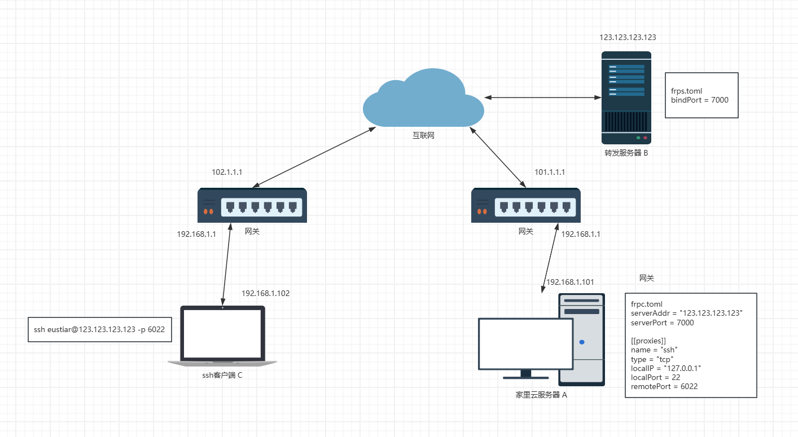

# utopia
家里游戏云说明手册，告君哥书。

### 前景提要
我已经装好了steamcmd以及需要的包。

### 游戏server下载/更新

```
steamcmd
login anonymous
app_update 2394010 validate # 安装+更新
quit
```

所以同理，如果要设置服务器定时更新，写个crontab在每天指定时间运行以下指令即可：
steamcmd + login anonymous + app_update 2394010 validate + quit + 服务器重启脚本

所有能用steamcmd开服的游戏都同理，只是app id不同。

### 启动服务器

开服脚本默认位置：
```
~/.local/share/Steam/steamapps/common/PalServer/PalServer.sh
```
由于咱们（暂时）没有公网ip，需要把服务器注册到帕鲁官方的community server列表里以便大家能够搜到。
需要如下参数：
```
./PalServer.sh -publiclobby
```

### 存档位置

服务器默认位置：
```
~/.local/share/Steam/steamapps/common/PalServer/Pal/Saved
```
由于steam平台在win和linux有不同的id，有些游戏在平台之间倒存档会导致人物角色丢失。
如何转移帕鲁存档：
https://billing.piglinhost.com/index.php?rp=/knowledgebase/108/How-can-i-upload-and-use-my-own-Palworld-world-save.html


### 创建轮椅
最好用screen创建一个自动重启+启动脚本，丢在用户根目录下，以便一键开关机。
类似于我用来重启饥荒的这个：
```
screen -dr dst_server1 -X quit
steamcmd.sh +login anonymous +force_install_dir /home/dst/server_dst +app_update 343050 validate +quit
sleep 10
sh start_server.sh
```

### 注意事项

目前我启动./PalServer.sh之后能在大厅列表搜到，但试图进入的时候服务器无响应。
大概率是由于没设置端口转发的缘故，根据reddit需要以下几个端口：
> 8211 (UDP), 27015-27017 (TCP+UDP)

还有少熬夜，多睡觉。

Enjoy yourself.

# HomeYun
家里云转发相关手册，告学姐书

### 内网穿透



如图所示，假如C想要ssh到A，可以通过两种方式
1. 有公网IP的情况下，访问请求公网IP 101.1.1.1，且在网关路由上设置虚拟服务器等方式(不然路由器不知道该把包发给谁)后访问。
2. 没有公网IP(或者担心被我DDoS不想用)的情况下，建立A与B的连接，C请求访问B，由B经由A-B连接将数据包转发给A，也就是内网穿透

### frp
这里内网穿透用的[frp](https://github.com/fatedier/frp)(96k star，值得信赖)，配置如图所示。
首先在B运行服务端
```
./frps -c ./frps.toml
```
此时frp会监听7000端口，所有frp client都会在启动时，往这个端口发送请求来注册，建立控制连接(这个连接会一直维持)。

如果需要提高安全性，则可以额外设置认证（frpc和frps需要同时设置），可以看我虚拟机里的配置文件
```
auth.method = "token"
auth.token = "any word you like but longer is better"
```
C运行客户端
```
./frpc -c ./frpc.toml
```
如前所述，frp客户端会向服务端注册，且向服务端frp告知，需要其监听remotePort(6022)端口，并将该端口的流量发回给A的localPort(22)端口

所以，当C通过以下命令尝试登录时
```
ssh eustiar@123.123.123.123 -p 6022
```
请求会先到B的6022端口，frps此时通过控制连接告知frpc有新请求，于是frpc再主动向frps建立一条连接，用于接收转发来的包(这一条是数据连接，frp跟ftp一样也是控制连接和数据连接分离的)。frpc收到转发来的包后，再把它转到指定的本地端口。

简单来说，其核心思想就是连接由位于内网的设备主动建立，外面转发来的包都是"回包"，就跟你访问网页返回数据一样，只不过可能返回的多了点。

如果需要开多个转发，可以用多个配置文件开多个frpc

### 最后

* 少熬夜，多睡觉
* 多玩游戏，享受生活
* 操作数据库之前三思